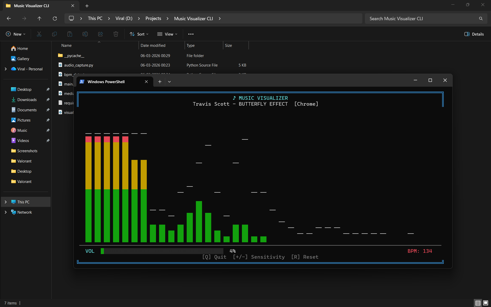

# 🎵 Music Visualizer CLI (Windows)


A real-time, terminal-based ASCII music visualizer built for Windows. It captures system audio on the fly, estimates BPM, and fetches the currently playing track's metadata to deliver a smooth, retro-aesthetic audio visualization experience right in your command line.
---

---

## ✨ Features

- **Live FFT Audio Bars:** Real-time visualization using WASAPI loopback (no virtual audio cables required).
- **Real-time BPM Estimation:** Analyzes audio flux and autocorrelation to guess the track's tempo.
- **Now-Playing Metadata:** Hooks into the Windows Media Control API to show what's currently playing (Spotify, YouTube, VLC, etc.).
- **Smooth Animations:** Powered by `curses` for flicker-free terminal rendering.
- **On-the-fly Controls:** Adjust sensitivity and visual parameters without restarting.

---

## ⚙️ Requirements

| Requirement | Details |
|-------------|---------|
| **OS** | Windows 10 or 11 |
| **Python** | 3.10 or higher |
| **Terminal** | Unicode-capable (recommended: [Windows Terminal](https://github.com/microsoft/terminal)) |

---

## 🚀 Installation

**1. Clone the repository**

```bash
git clone <your-repo-url>
cd "Music Visualizer CLI"
```

**2. Create a virtual environment** *(Recommended)*

```bash
python -m venv .venv
.venv\Scripts\activate
```

**3. Install core dependencies**

```bash
pip install -r requirements.txt
```

**4. Install optional dependencies** *(Required only if you want system volume polling enabled)*

```bash
pip install pycaw comtypes
```

---

## 🎮 Usage

Run the main script to start the visualizer:

```bash
python main.py
```

> **Note:** Make sure audio is actively playing through your default output device before launching, or the visualizer may not pick up the audio stream!

### Keyboard Controls

| Key | Action |
|-----|--------|
| `Q` | Quit the application |
| `+` / `-` | Increase or decrease audio sensitivity |
| `R` | Reset visual smoothing and peak markers |

---

## 🧠 How It Works

The project is modularized into specific Python scripts to handle different aspects of the pipeline:

| File | Responsibility |
|------|---------------|
| `audio_capture.py` | Captures system output audio via WASAPI loopback and computes the FFT bands. |
| `bpm_detector.py` | Estimates the current BPM from spectral flux and autocorrelation. |
| `media_info.py` | Reads current media metadata via the Windows Media Control API (WinRT). |
| `visualizer.py` | Renders the animated ASCII bars and status UI using the `curses` library. |
| `main.py` | The primary application loop that orchestrates components and handles keyboard inputs. |

---

## 🛠️ Troubleshooting

<details>
<summary><strong>"WASAPI not available" / "Could not find a loopback device"</strong></summary>

- Verify you are running the script on Windows.
- Ensure your default audio output device is active and not muted.
- Start playing some audio before running the script and retry.

</details>

<details>
<summary><strong>No media title shown</strong></summary>

- Ensure the app playing the media is supported by the Windows Media API (e.g., Spotify, Chrome, Edge).
- Confirm the `winrt-Windows.Media.Control` package is installed successfully.

</details>

<details>
<summary><strong>Garbled symbols or missing colors</strong></summary>

- You are likely using the legacy Windows Command Prompt (`cmd.exe`). Switch to [Windows Terminal](https://github.com/microsoft/terminal) or another terminal with full Unicode and ANSI color support.
- Ensure your terminal font supports standard box-drawing characters (e.g., Cascadia Code, Consolas, or a Nerd Font).

</details>

---

## 📄 License

This project is licensed under the **MIT License**.
See the [`LICENSE`](LICENSE) file for full details.
